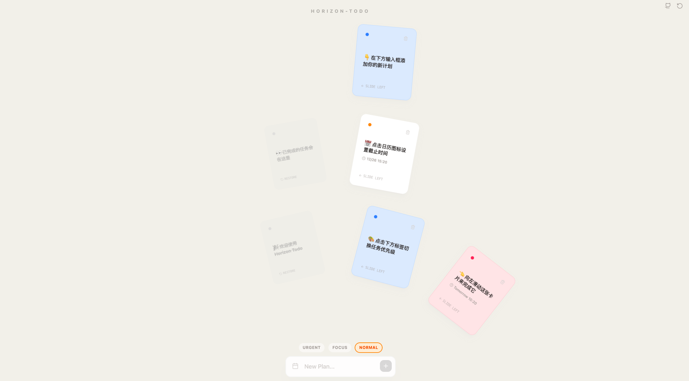

<p align="center">
  
</p>

<p align="center">
  <ins><b>A minimalist to-do list pursuing the ultimate visual experience.</b></ins>
</p>

<p align="center">
  <b>English</b> | <a href="./README_CN.md">中文</a>
</p>

<p align="center">
  <!-- Replace with your actual Vercel link -->
  <a href="https://horizon-todo.vercel.app">
    
  </a>
  
</p>

<p align="center">
  🔗 <b>Live Demo:</b> <a href="https://horizon-todo.vercel.app/" target="_blank">https://horizon-todo.vercel.app/</a>
</p>

---

## 📸 Visual Preview

<p align="center">
  
</p>

> **Design Philosophy:** Breaking free from traditional lists, redefining task management with a dynamic card layout (Sector Grid).

---

## ✨ Core Features

- 🧩 **Sector Grid Layout**: Breaking conventions, scattering tasks like stars on a canvas.
- 🌈 **Priority Color Scheme**: `Urgent`, `Focus`, and `Normal` - three distinct visual tiers.
- 🍃 **Minimalist Interaction**: Clean input design, focusing purely on "recording".
- ☁️ **Continuous Integration**: Automated deployment via Vercel, updates on commit.

---

## 🛠 Tech Stack

<p align="left">
  
</p>

---

## 🚀 Quick Start

```bash
# Clone the repository
git clone https://github.com/CQUPT-CZL/horizon-todo.git

# Navigate to directory
cd horizon-todo

# Install dependencies
npm install

# Run locally
npm run dev
```

## 📄 License

MIT License
